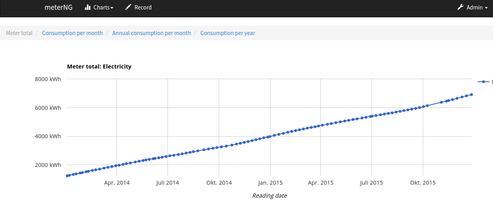
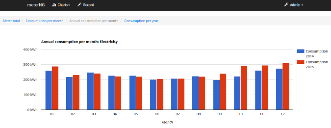
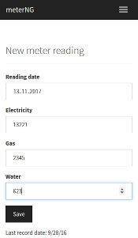

# meterNG [](https://travis-ci.org/0xERR0R/meterNG)


#### meterNG is a small tool with web UI to record meter readings in a household and track consumptions. This application does not need any cloud for data storage or syncronization. All data will be stored localy. Works fine on Raspberry PI 2 or 3!

## Features
* Web UI to record new meter readings from a smart phone
* Charts in Web UI with consumption over a certain period of time
* Import and Export to/from a CSV file
* Optional: periodical mail with CSV file as backup (Mail configuration necessary, see below)
* Optional: periodical reminder mail if X days elapsed since last reading date (Mail configuration necessary, see below)

Chart view                                                 |  New record view
:-------------------------------------------------------   |    ----------------------:
  |  


## Configuration
#### Application configuraion:

| Property            | Description | Default value |
| ------------------- | ----------- | ------------- |
|config.allMeters     |comma separated list of meters. Format: meterName(Unit)|- |
| notificationMail.enabled| Enables notification mail about overdue reading | false |
| notificationMail.daysAfterLastReading | Amount of days elapsed since last reading to trigger the email notification | 7 |
| notificationMail.recipient | email recipient | - |
| notificationMail.url | Url, which will be displayed in the notification mail | - |
| notificationMail.cron | Cron syntax for the notification job | 0 0 7 \* \* \* |
| notificationMail.meterNamesForNotification | if set, only defined meters will be user to determine the last reading date | - |
| backupMail.enabled | Enables mail with backup | false |
| backupMail.cron | Cron syntax for the backup job |0 0 0 1 \* \* |

#### Email configuration
To send mails, meterNG needs a SMTP server with valid account. For configuration see the example below. For advanced config see [Spring Boot Mail Properties](https://docs.spring.io/spring-boot/docs/current/reference/html/common-application-properties.html)

#### Example configuration (application.properties)
```
config.allMeters = Electricity(kWh), Gas(m³)
notificationMail.enabled = true
notificationMail.recipient = me@example.com
notificationMail.url = pi.local:8080
spring.mail.host = smtp.gmail.com
spring.mail.username = xxx@googlemail.com
spring.mail.password = xxx
spring.mail.properties.mail.smtp.auth = true
spring.mail.properties.mail.smtp.socketFactory.port = 465
spring.mail.properties.mail.smtp.socketFactory.class = javax.net.ssl.SSLSocketFactory
spring.mail.properties.mail.smtp.socketFactory.fallback = false
```

## Install
* Download jar file
* put your application.configuration in the same directory
* run with Java8: java -jar -Xms32m -Xmx64m meterNG.jar

## Advanced usage
meterNG uses embedded database (H2) by default. The database file will be stored in the working directory. You can use MySQL for data storage, just add database url und database credentials to the application.properties.
#### Example configuration with MySQL database (application.properties)
```
spring.datasource.url=jdbc:mysql://localhost:3306/db_example
spring.datasource.username=dbuser
spring.datasource.password=dbpassword
```
